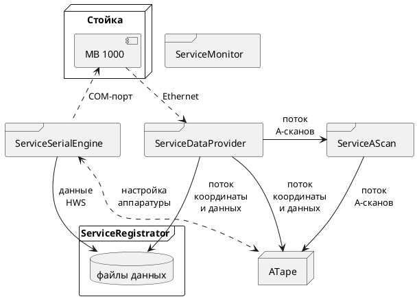

# Проект Avikon03M

## Описание файлов входящих в состав поставки комплекса

| Название | Назначение |
|-----|-----|
| AmplColor.xml | настройка преобразования амплитуда-цвет |
| atape.cfg | хранение настроек программы ATape, включая настройки схем прозвучивания |
| [ATape_new.exe](#atape) | главная программа управления комплексом (заведение регистрации, шифровка данных) |
| ATapeCfg.exe | программа настройки путевой части и параметров ЕКАСУИ |
| ATapeXP_Setup_* | маркер инсталляции |
| AutoKMbeatGPS.exe | программа автоматических отбоев КМ столбов по GPS |
| AvikonClient.exe | программа управления комплексом по протоколу ПУСК |
| AvikonVideoPlayer.exe | программа автономного просмотра видеоданных |
| CorrectWheelConstByGps.exe | программа подстройки константы колеса по данным GPS |
| EDAC.xml | файл настроек программного ВРЧ |
| ekasui.cfg | файл настроек ЕКАСУИ |
| GetFilesDescription.exe | утилита сбора версий файлом для формирования отчета об ошибках |
| ImageProcessing.dll | библиотека обработки видеоданных |
| import.*.cfg | файлы расширения контекстного меню ATape |
| IPathGen.exe | утилита формирования файла путейской координаты по различным источникам |
| MakeAtapeCfg.exe | утилита первоначальной настройки atape.cfg и preference.cfg |
| MakeFragment.exe | утилита формирования вырезок проездов |
| Plugins.cfg | описание и настройки плагинов обработки данных |
| preferences.cfg | настройки программы ATape |
| ShowDataInfo.exe | утилита "Информационная панель БПД" |
| SpecUserMark.xml | описание типов специальных пользовательских отметок |
| SpecUserMarkFilter.xml | настройки фильтрации специальных пользовательских отметок |
| SumFilter*.xml | настройки фильтрации специальных пользовательских отметок |
| tooltips.xml | строки всплывающих подсказок |
| TuneCanBeRegistrator.exe | утилита настройки видимости схем прозвучивания |
| DataDriver/* | драйверы данных и из настройки |
| PLDLoader/* | утилита для отладки МВ |
| Plugin/* | плагины обработки данных |
| Scripts/* | скрипты построения отчетов, формирования панели отметок и внешних объектов |
| Services/AvikonSvc.exe | запуск сервисов |
| Services/ServiceAScan.dll | сервис рассылки А-сканов|
| [Services/ServiceDataProvider.dll](#servicedataprovider) | сервис взаимодействия с МВ |
| [Services/ServiceMonitor.dll](#servicemonitor) | сервис построения конфигураций на основе обнаруженных компонентов |
| [Services/ServiceRegistration.dll](#serviceregistration) | сервис записи данных |
| [Services/ServiceSerialEngine.dll](#serviceserialengine) | сервис управления стойкой |
| Services/ADSP/* | файлы для работы МВ |
| Services/Config/EtherChannelDesc.xml | описание распределения данных в пакетах от ВМ |
| Services/Config/SE_SCRIPT_*.xml | описание команд управления светом камер |
| Services/Config/SerialEngineConfig.xml | описание команд управления стойкой |
| Services/Config/SerialEngineScript.lua | описание команд управления стойкой  |
| Services/Config/SerialEngineScript.xml | настройка канала управления стойкой |
| Services/Config/services-config.xml | описание конфигураций комплекса |
| Telegrams/* | шаблоны формирования отчетных форм |
| [VideoServices/ServiceVideoRegistrator.dll](#servicevideoregistrator) | сервис видео-данных (получение, запись, выдача) |
| VideoServices/Config/video-config.xml | описание настроек видео каналов |
| ViewsDescription/Data_Default.xml | настройки расположения представления данных |
| ViewsDescription/VideoComp_*.xml | настройки режимов отображения видео |

## Схема взаимодействия компонентов комплекса

Основная задача комплекса: сбор и отображение данных УЗ и магнитного канала, а так же видео данных.

## Описание сервисов

### ServiceMonitor

Служба Мониторинга Топологий.

- Следит за сервисами, запущенными на локальном компьютере,
- обменивается этим списком с сервисМониторами, запущенными на других компьютерах,
- раздает конфигурацию комплекса,
- управляет глобальным состоянием комплекса (параметры регистрации).

### ServiceDataProvider

Сервис дата-провайдер.

Служба взаимодействия c `МВ 1000`. Осуществляет:

- загрузку МВ,
- восстановление параметров МВ после перезапуска стойки,
- загрузку в МВ параметров регистрации,
- установку параметров ВМ специфичных для схем прозвучивания,
- чтение данных УЗ и магнитного каналов из Ethernet пакетов и упаковку их в блоки,
- трансляцию А-Сканов в ServiceAScan.

### ServiceRegistration

Служба Регистрации.

При старте регистрации получает список источников данных, подключается к ним и сохраняет полученные данные на диск.

В частности:

- паспорт данных,
- УЗ и магнитные каналы,
- положения отбоев КМ столбов
- настройки аппаратуры,
- GPS и температуру,
- отметки пользователя,
- секундные метки,
- специальные пользовательские отметки,
- различные индексы, для облегчения позиционирования по данным.

### ServiceSerialEngine

Служба Управления Настройками Аппаратуры.

- Принимает команды управления стойкой,
- на основе скрипта `SerialEngineScript.xml` формирует последовательности байт, которые
- отправляться в стойку через COM-порт,
- ответ вычитывается, разбирается и форматируется в специальный XML, который
- рассылается специальным широковещательным потоком.

В основном с сервисом взаимодействуют две программы: `ATape` и `CrateTuner`.

На компьютерах, предназначенных для записи видеоданных сервис используется для управления фарами.

### ServiceAScan

Служба Раздачи Потоков АСкан.

Ретрансляция, для снижения нагрузки, потока А-сканов с ServiceDataProvider потребителям.

### ServiceVideoRegistrator

Служба Регистрации Видео.

- Инициализирует и управляет Камерами,
- собирает и обрабатывает данные с камер,
- транслирует живые видео данные,
- сохраняет данные на диск,
- отдает записанные данные для просмотра.

## Описание программ

### ATape

Основная программа управления комплексом. Позволяет:

- запускать, останавливать, следить за статусом регистрации,
- следить за живыми данными (А-сканы, Видео),
- управлять настройками аппаратуры,
- контролировать качество записи в регистрации.

А так же:

- Просматривать записанные данные для поиска дефектов,
- устанавливать отметки записной книжки,
- просматривать результаты автоматической обработки УЗ и видео,
- формировать отчеты и результирующие формы.
